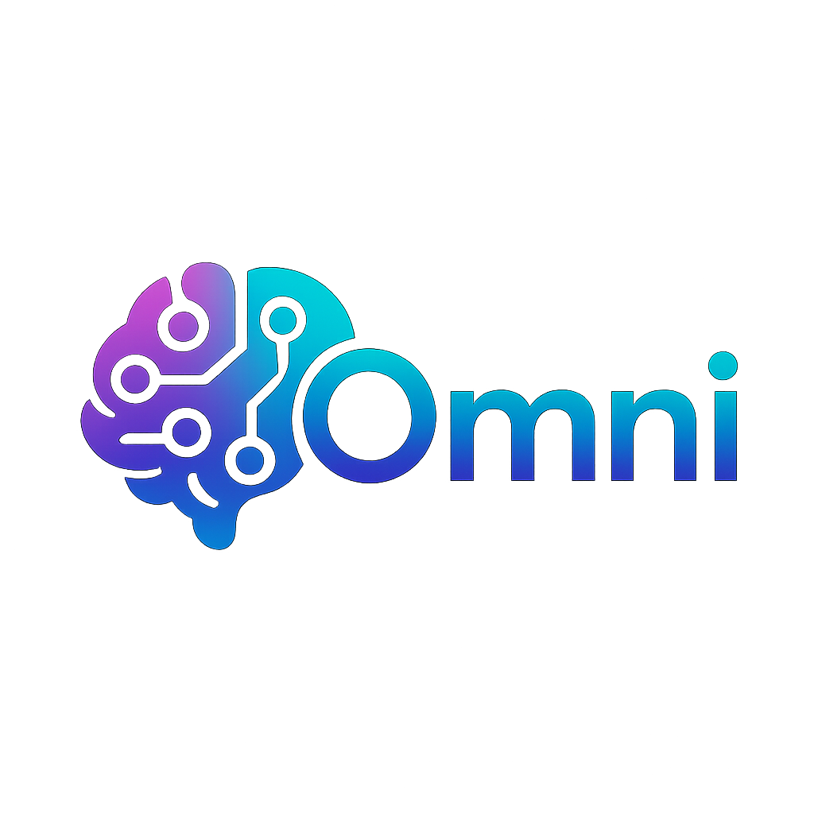

# 🤖 SUI Daily Assistant

<div align="center">
  

  **An intelligent AI agent designed to serve as a comprehensive daily companion for active users of the SUI blockchain ecosystem.**

  [](https://nextjs.org/)
  [](https://www.typescriptlang.org/)
  [](https://sui.io/)
  [](https://openai.com/)
</div>

---

## ✨ What is SUI Daily Assistant?

SUI Daily Assistant is your intelligent blockchain companion that transforms raw blockchain and social media data into actionable insights. By leveraging advanced AI analysis and real-time data aggregation, it enables you to make informed decisions in the fast-paced crypto environment.

### 🎯 Key Features

- **🐦 Twitter Sentiment Analysis**: Real-time SUI community sentiment tracking
- **📊 Market Intelligence**: AI-powered token analysis and recommendations
- **💱 Seamless Token Swapping**: Execute trades directly through the interface
- **🚨 Proactive Alerts**: Real-time notifications for market opportunities
- **💬 Natural Language Chat**: Interact with AI for market insights and analysis

## 🚀 Project Status

This is a hackathon project with a structured implementation plan. The project is currently in the **scaffolding phase** with all files created and TODO comments in place for systematic implementation.

## 🏗️ Project Structure

```
sui-hackathon/
├── src/
│   ├── components/          # React components
│   │   ├── layout/         # Layout components
│   │   ├── dashboard/      # Dashboard components
│   │   ├── chat/          # Chat interface
│   │   ├── alerts/        # Alert system
│   │   ├── market/        # Market data display
│   │   └── swap/          # Swap interface
│   ├── lib/
│   │   ├── services/      # API service layers
│   │   └── langchain/     # LangChain tools
│   ├── hooks/             # Custom React hooks
│   ├── store/             # Jotai atoms
│   └── types/             # TypeScript definitions
├── app/
│   ├── api/               # Next.js API routes
│   │   ├── chat/         # AI chat endpoint
│   │   ├── alerts/       # Real-time alerts
│   │   ├── market/       # Market data
│   │   ├── twitter/      # Twitter sentiment
│   │   └── swap/         # Swap execution
│   └── page.tsx          # Main page
└── docs/                 # Documentation
```

## 🛠️ Tech Stack

### Frontend
- **Framework**: Next.js 15.3.3 with App Router
- **Language**: TypeScript 5.0
- **UI Components**: shadcn/ui + Tailwind CSS 4.1.8
- **State Management**: Jotai 2.12.5
- **Fonts**: Space Grotesk, Inter, JetBrains Mono

### AI & Intelligence
- **LLM**: OpenAI GPT-4 + Grok AI (X.ai)
- **Agent Framework**: LangChain + LangGraph
- **Processing**: Real-time analysis and sentiment tracking

### Blockchain & DeFi
- **Blockchain**: SUI Network
- **Wallet Integration**: @mysten/dapp-kit
- **DEX Integration**: 7k Protocol SDK
- **LP Tools**: kunalabs-io/kai package

### Real-time & APIs
- **Real-time Updates**: Server-Sent Events (SSE)
- **Twitter API**: twitterapi.io integration
- **Market Data**: CoinGecko API
- **Package Manager**: pnpm

## 🌟 What Makes SUI Daily Assistant Unique?

- **🧠 Intelligent Analysis**: Combines multiple AI models for comprehensive market intelligence
- **⚡ Real-time Processing**: Instant alerts and updates via Server-Sent Events
- **🔗 Seamless Integration**: Direct DEX integration for one-click trading
- **🎯 Personalized Insights**: AI learns from your preferences and trading patterns
- **🛡️ Security First**: Non-custodial wallet integration with transaction simulation
- **📱 Mobile Optimized**: Progressive Web App with offline capabilities

## 🚀 Getting Started

### Prerequisites
- Node.js 18+
- pnpm (recommended) or npm
- SUI Wallet browser extension

### Installation

1. **Clone and install dependencies**:
```bash
git clone <repository-url>
cd sui-hackathon
pnpm install
```

2. **Set up environment variables**:
```bash
cp .env.example .env.local
# Edit .env.local with your API keys:
# - OPENAI_API_KEY=your_openai_key
# - GROK_API_KEY=your_grok_key
# - TWITTER_API_KEY=your_twitter_key
# - COINGECKO_API_KEY=your_coingecko_key (optional)
```

3. **Start development server**:
```bash
pnpm dev
```

4. **Open your browser**:
Navigate to `http://localhost:3000` and connect your SUI wallet to get started!

### Development Workflow
- See `IMPLEMENTATION_PLAN.md` for detailed task breakdown
- Each file contains TODO comments with specific implementation steps
- Follow the numbered TODO sequence for systematic development

## 📝 Implementation Guide

### Phase 1: Foundation (#TODO-1 to #TODO-5)
- Set up dependencies and configuration
- Configure environment variables
- Set up TypeScript types

### Phase 2: UI Components (#TODO-6 to #TODO-8) - SIMPLIFIED
- Create simple full-screen chat interface (NO navigation/headers)
- Build message display and input components
- Implement chat state management
- DEFER: Alert system UI and token display UI

### Phase 3: API Integration (#TODO-11 to #TODO-15)
- Twitter API integration
- CoinGecko API setup
- AI service integration
- SUI blockchain connection
- Real-time SSE setup

### Phase 4: Intelligence Layer (#TODO-16 to #TODO-20)
- Twitter sentiment analysis
- Market intelligence
- Alert classification
- LangChain orchestration
- AI recommendations

### Phase 5: Blockchain Features (#TODO-21 to #TODO-25)
- Wallet connectivity
- DEX integration
- Swap functionality
- Transaction handling
- Portfolio tracking

### Phase 6: Real-time & Polish (#TODO-26 to #TODO-35)
- Background monitoring
- Real-time alerts
- Error handling
- Mobile optimization
- Final integration

## 🔑 Required API Keys

- **Twitter API**: twitterapi.io account
- **OpenAI**: GPT-4 API access
- **Grok AI**: Grok API access
- **CoinGecko**: API key (optional, has free tier)

## 🎯 Core Features (Phase 1 - First 3 Only)

**SIMPLIFIED UI: Chatbox interface only - no navigation, headers, or complex layouts**

1. **Twitter Sentiment Analysis**: Real-time SUI community sentiment tracking
2. **Market Intelligence**: AI-powered token analysis and recommendations
3. **Chat Interface**: Natural language interaction with AI assistant for insights

**DEFERRED (implement after core features):**
- Proactive Alerts UI
- Token Display UI
- Swap Interface UI

## 📱 Usage

Once implemented, users can:
- Get morning briefings on SUI ecosystem developments
- Receive real-time alerts for market opportunities
- Chat with AI for market analysis and recommendations
- Execute token swaps directly through the interface
- Track portfolio performance and get optimization suggestions

## 🔧 Development Notes

- This is a hackathon project focused on speed over perfection
- No testing/security/auditing implemented initially
- Text-only interaction for simplicity
- All TODO comments are numbered for sequential execution
- Use the implementation plan as a roadmap

## 📚 Documentation

- `PRD.md`: Complete product requirements document
- `IMPLEMENTATION_PLAN.md`: Detailed implementation roadmap
- Each file contains inline TODO comments with specific tasks

## 🤝 Contributing

Follow the TODO sequence in the implementation plan. Each task is designed to build upon the previous ones for efficient development.

### Development Guidelines
- Use TypeScript for all new code
- Follow the established component structure
- Add proper error handling and loading states
- Test with multiple wallet providers
- Ensure mobile responsiveness

## 📄 License

This project is licensed under the MIT License - see the [LICENSE](LICENSE) file for details.

## 🔗 Links & Resources

- **SUI Network**: [https://sui.io/](https://sui.io/)
- **SUI Documentation**: [https://docs.sui.io/](https://docs.sui.io/)
- **7k Protocol**: [https://7k.ag/](https://7k.ag/)
- **LangChain**: [https://langchain.com/](https://langchain.com/)
- **shadcn/ui**: [https://ui.shadcn.com/](https://ui.shadcn.com/)

## 🙏 Acknowledgments

- SUI Foundation for the amazing blockchain infrastructure
- OpenAI and X.ai for AI capabilities
- The open-source community for the incredible tools and libraries

---

<div align="center">
  <p>Built with ❤️ for the SUI ecosystem</p>
  <p>
    <a href="https://sui.io/">SUI Network</a> •
    <a href="https://twitter.com/sui_daily_assistant">Twitter</a> •
    <a href="mailto:team@suidailyassistant.com">Contact</a>
  </p>
</div>
